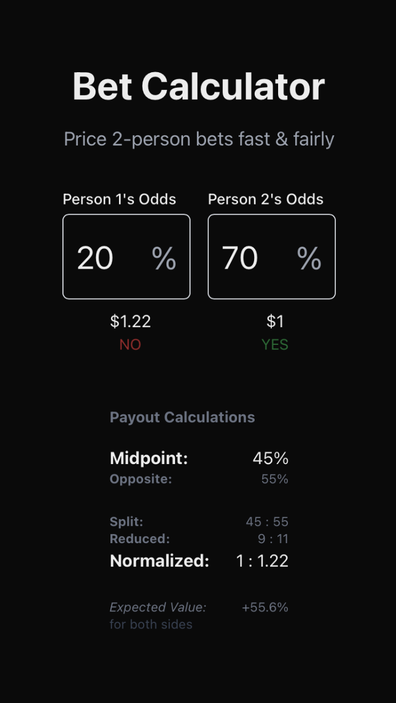

# &nbsp; [bet.dsernst.com](https://bet.dsernst.com)

<p align="center"></p>

## Development

This is a [Next.js](https://nextjs.org/) project.

## Getting Started

### First time

1. Fork repo
2. Clone it down with `git clone`
3. Install dependencies with `npm install` or equivalent.

### Then to start the development server:

```bash
npm run dev
```

Open [http://localhost:3000](http://localhost:3000) with your browser to see the result. 🎉
